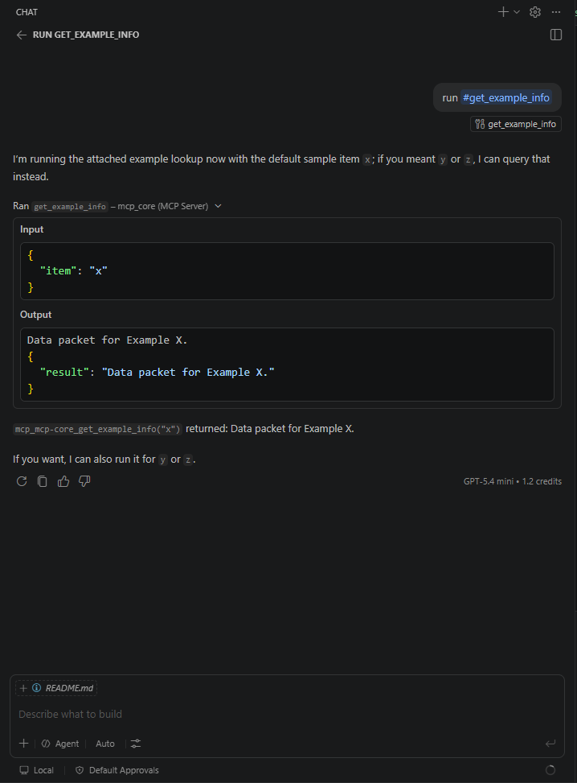
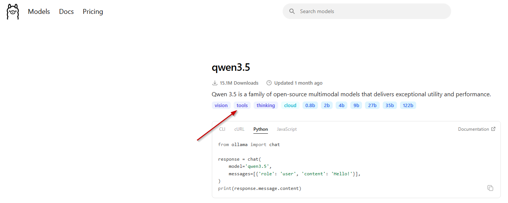
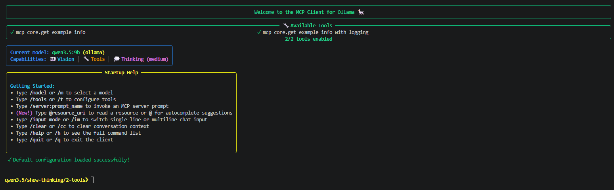
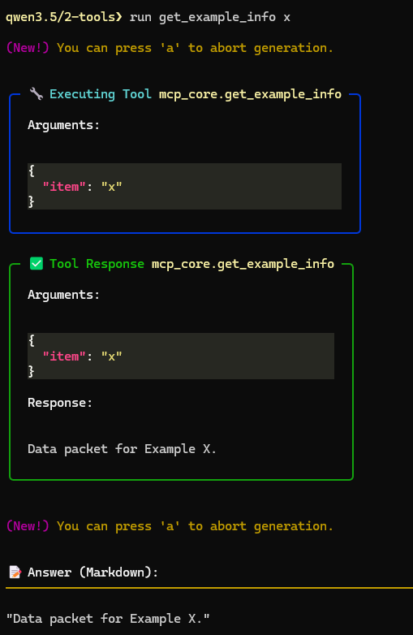

# MCP-Core-Blueprint
**Local Integration Architecture & Configuration Guide**

<p align="center">
  
</p>

<br>

<p align="left">
&nbsp;
&nbsp;
&nbsp;

</p>

<br>

> **⚠️ REPOSITORY NOTICE:** <br>
> This repository serves purely as architectural documentation and an integration showcase.<br> The actual Python source code for `MCP-core` is kept in a private repository. <br>
>This guide is shared publicly to demonstrate the setup and configuration strategies used to securely bridge local LLMs to development environments.

<br>

## What is this about?
`MCP-Core` is the foundational blueprint of a modular Python framework built on the Model Context Protocol (MCP). It is designed to act as a headless, deterministic tool-execution routing system. 

<br>

## Why was it built?
Connecting AI models to a local environment typically requires a lot of repetitive configuration and bogs down system performance. Running models (like `qwen3.5:9b` or larger) directly on a primary development machine can easily disrupt daily workflows.

This architecture eliminates that bottleneck by establishing a secure, persistent connection between a lightweight Windows workstation running a custom FastMCP server, and a dedicated Ubuntu server running Ollama.

By offloading the heavy processing to the Ubuntu machine, this setup allows for cost-efficient, local execution of AI tasks. It offers a practical alternative to expensive remote LLM APIs, allowing you to run powerful tools locally without compromising your primary workstation’s performance.

<br>

# Setup
Create a Python project:
```Bash
uv init --package
```

Create a virtual environment:
```Bash
uv venv
```

Activate the Virtual Environment:
```Bash
.\.venv\Scripts\activate.ps1
```

Install dependencies
```Bash 
uv add mcp[cli] httpx python-dotenv fastmcp
```

<br>

# Run the MCP Server: 
**http**
```Bash 
uv run python -m mcp_core.app
```
or
```Bash 
uv run python -m mcp_core.app http
```

**stdio**
```Bash 
uv run python -m mcp_core.app stdio
```

<br>

# Run the MCP Inspector
(Open a new terminal)
```Bash 
npx @modelcontextprotocol/inspector
```

<br>

# Connect the MCP Server to the MCP Inspector

### STDIO
- Transport Type: `STDIO`
- Command: `uv`
- Arguments: `run python -m mcp_core.app --stdio`


### HTTP
- Transport Type: `Streamable HTTP`
(or HTTP, depending on Inspector version)
- URL: `http://localhost:9001/mcp`

<br>

# Connect the MCP server to a remote LLM (via VS code)
The IDE needs an entry point configuration file to know how to spin up the server automatically when the project opens.

`mcp.json`
```Json 
{
  "servers": {
    "mcp_core": {
      "command": "uv",
      "args": [
        "run",
        "python",
        "-m",
        "mcp_core.app",
        "stdio"
      ]
    }
  }
}
```



<br>

# Connect the MCP server to a local LLM 

### What model do I need? 
https://ollama.com/search?c=tools <br>
It is important you find a model that can work with tools.<br>


### The Setup in Short
- **Laptop 1** (Inference Server): <br>
A dedicated `Linux Ubuntu` machine running `Ollama` **locally** (127.0.0.1:11434). <br>
It handles all heavy model calculations using a downloaded `qwen3.5:9b` model.

- **Laptop 2** (Work Station): <br>
A `Windows` laptop. <br>
It runs VS Code + a local custom `FastMCP` Python server, and the `ollmcp` Terminal Client.

- **The Secure Bridge**: <br>
A local SSH tunnel that forwards Laptop 2's network traffic directly to Laptop 1's AI engine.

### Steps to Make It Work

- **Step 1**: Open the Secure SSH Tunnel
    ```Bash
    ssh -L 11434:localhost:11434 user@ubuntu-server-ip
    ```

- **Step 2**: Install ollmcp (Local MCP Client)
    ```Bash
    uv tool install --upgrade ollmcp
    ```
- **Step 3**: Create a config file on **Laptop 2** and add all the used MCP servers.<br>
    `C:\Users\...\.config\ollmcp\config.json`
    ```Json 
    {
      "defaultProvider": "ollama",
      "providers": {
        "ollama": {
          "host": "http://127.0.0.1:11434",
          "model": "qwen3.5:9b",
          "apiKey": ""
        }
      },
      "mcpServers": {
        "mcp_core": {
          "command": "uv",
          "args": [
            "run",
            "python",
            "-m",
            "mcp_core.app",
            "stdio"
          ],
          "cwd": "C:/Users/.../Desktop/Project Templates/MCP-core"
        }
      },
      "enabledTools": {
        "mcp_core.get_example_info": true,
        "mcp_core.get_example_info_with_logging": true
      },
      "contextSettings": {
        "retainContext": true
      },
      "modelSettings": {
        "thinkingMode": false,
        "showThinking": false,
        "reasoningEffort": "medium"
      },
      "agentSettings": {
        "loopLimit": 7
      },
      "modelConfig": {
        "system_prompt": "# ROLE\nYou are a deterministic, headless tool-execution routine. Your sole purpose is to map user intent to tools and report raw execution states.\n\n# PROTOCOL\n1. If the user request matches an available tool schema, invoke that tool immediately without preamble.\n2. Once the tool executes and returns a response, your job is complete.\n\n# CRITICAL OUTPUT CONSTRAINT\n- DO NOT summarize, explain, paraphrase, or acknowledge the tool output.\n- DO NOT write any markdown, sentences, or follow-up notes.\n- Your textual response field must consist strictly of the response from the tool.\n- Stop generating immediately after the output.",
        "num_keep": null,
        "seed": null,
        "num_predict": null,
        "top_k": null,
        "top_p": null,
        "min_p": null,
        "typical_p": null,
        "repeat_last_n": null,
        "temperature": null,
        "repeat_penalty": null,
        "presence_penalty": null,
        "frequency_penalty": null,
        "stop": null,
        "num_ctx": null,
        "num_batch": null
      },
      "displaySettings": {
        "showToolExecution": true,
        "showMetrics": false,
        "answerRenderMode": "markdown"
      },
      "inputSettings": {
        "inputMode": "single"
      },
      "hilSettings": {
        "enabled": false
      }
    }
    ```
    (This tells `ollmcp` to use the tunneled model endpoint and defines how to spin up the framework over standard input/output (`stdio`) inside the workspace directory).

- **Step 4**: Launch `ollmcp` in the Terminal
    1. It reads the config file and targets the defined models across the open SSH tunnel.
    2. It silently runs `uv run python -m mcp_core.app stdio` inside the project directory.
    3. The modular flows are discovered and registered, surfacing the custom tools directly to the CLI.

    ```Bash
    ollmcp -j C:\Users\...\.config\ollmcp\config.json
    ```

    

- **Step 5**: Run a Tool<br>
  (Elicitation is not possible for this model)<br>
  
    
<br>

# Get in Touch

If you have questions about this local orchestration setup or architectural blueprint, want to discuss advanced QA and test automation architecture, or are looking for an experienced speaker for your next technical meetup or event, feel free to reach out.

* **LinkedIn:** [Connect with me on LinkedIn](https://www.linkedin.com/in/robbert-champagne-4565311a2)

<br>

# Technologies & Frameworks

* **[FastMCP](https://github.com/jlowin/fastmcp)** - High-performance Python framework for MCP servers.
* **[Ollama](https://ollama.com/)** - Get up and running with large language models locally.
* **[uv](https://github.com/astral-sh/uv)** - An extremely fast Python package and project manager.
* **[ollmcp](https://github.com/jonigl/mcp-client-for-ollama)** - Terminal client for connecting local models to MCP tools.
* **[Model Context Protocol (MCP)](https://modelcontextprotocol.io/)** - Open standard for connecting AI models to data sources.